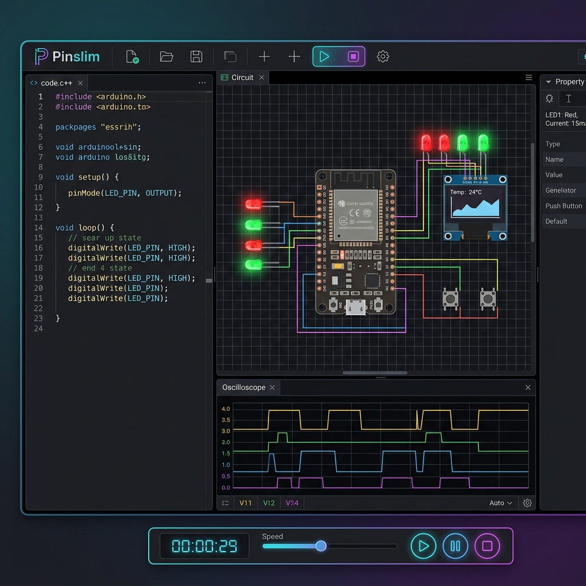
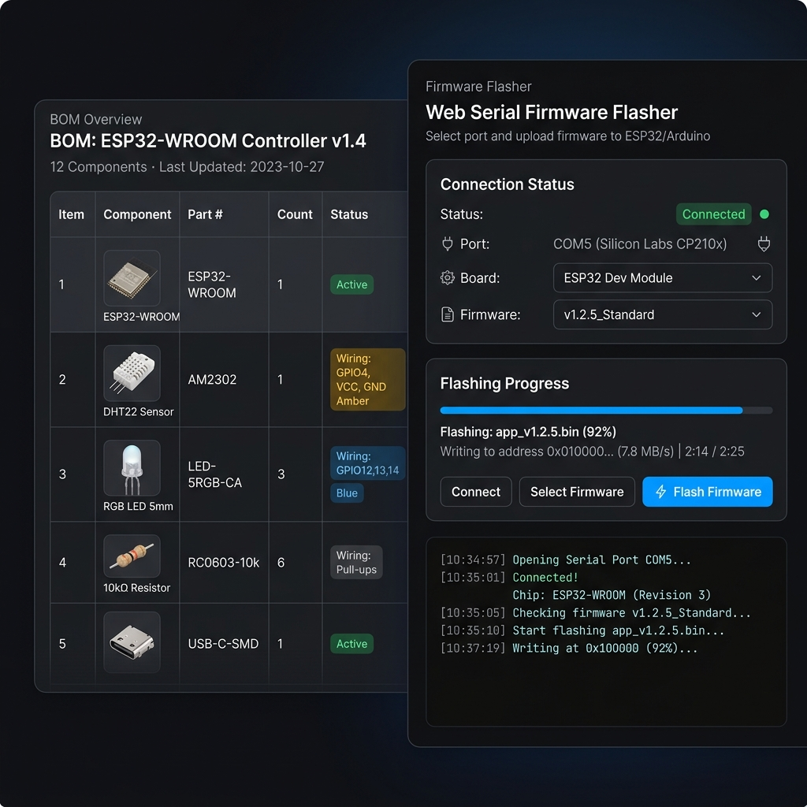

# Pinslim: Browser-Based Embedded Simulator & Hardware Flasher

> [!IMPORTANT]
> **Origin, Acknowledgments & Commercial Licensing Notice**  
> **Pinslim** is an independent, open-source fork based on [**Velxio**](https://github.com/davidmonterocrespo24/velxio), an outstanding embedded circuit simulator created by **David Montero Crespo** ([velxio.dev](https://velxio.dev)). We express our deepest gratitude to David Montero Crespo for his incredible work and contributions to the open-source hardware community!
> 
> - **Commercial Licenses & Paid Tiers**: Any commercial licenses, paid subscriptions, or Pro-tier features can **ONLY** be purchased or acquired through [**velxio.dev**](https://velxio.dev) or directly from the original developer, David Montero Crespo.
> - **Exclusive Features & Boards**: Certain online features and advanced board options are exclusive to the platform at [velxio.dev](https://velxio.dev). In Pinslim, these exclusive items are prominently marked with a distinct **`velxio.dev exklusiv`** badge.

<p align="center">
  
</p>

**Pinslim** is an open-source multi-board emulator, circuit simulator, and browser hardware flasher for ESP32, Arduino, and embedded systems.

Write Arduino C++, MicroPython, or Python code, compile it, simulate real CPU execution with 150+ interactive electronic components, and flash your compiled code directly to connected hardware via Web Serial — all inside your browser.

---

## 🚀 Features

- **Direct Editor Launch**: Opens directly in the interactive workspace.
- **Light & Dark Themes**: Toggle seamlessly between Dark and Light mode via the View menu.
- **Web Serial Hardware Flashing**: Flash compiled sketches directly to connected ESP32 or Arduino microcontrollers via Web Serial without installing desktop software.
- **Multi-Board Simulation**: Emulates AVR8 (Arduino Uno / Nano / Mega / ATtiny85), RP2040 (Raspberry Pi Pico), and ESP32 (QEMU backend).
- **Embedded Examples Modal**: Instantly search and load ready-to-run example projects from within the editor.
- **BOM & Schematic Export**: Generate accurate Bill of Materials (CSV) and high-fidelity PNG schematic diagrams.
- **Open-Source Docker Deployment**: Hardened standalone Docker setup requiring no proprietary license keys.

<p align="center">
  
</p>

---

## 🐳 Quick Start (Docker)

To run Pinslim locally or on your server with Docker:

```bash
docker compose up -d --build
```

Then open **<http://localhost:3082>** in your browser.

---

## 🔒 Security & Server Hardening

For details on deploying Pinslim securely on your own server (process isolation, capability dropping, CPU/RAM limits, sub-process sandboxing), see the [SECURITY.md](SECURITY.md) guide.

---

## 📜 Legal, AI Development & Trademark Disclaimers

### 1. Origin Notice & Gratitude
Pinslim is an independent open-source fork based on **Velxio**, created by **David Montero Crespo**.
- Original Repository: [github.com/davidmonterocrespo24/velxio](https://github.com/davidmonterocrespo24/velxio)
- Official Platform: [velxio.dev](https://velxio.dev)

Special thanks to **David Montero Crespo** for architecting the original simulator engine.

### 2. AI-Assisted Development Notice (Antigravity)
All modifications, code refactorings, UI/UX optimizations, Bill of Materials (BOM) & PNG export capabilities, Web Serial flasher integration, and Docker security hardening were developed in pair-programming collaboration with the AI coding assistant **Antigravity** (Google DeepMind).

### 3. Trademark Disclaimer
All product names, trademarks, logos, and brands mentioned in this project (such as *Arduino, ESP32, Espressif, Raspberry Pi, MicroPython, SAMD, RP2040, etc.*) are the property of their respective trademark owners. Pinslim is an independent open-source community project and is **not affiliated with, sponsored by, or endorsed by** any of these trademark holders.

### 4. Commercial Licensing Disclaimer
Commercial licenses or Pro subscriptions are sold exclusively by David Montero Crespo via [velxio.dev](https://velxio.dev). Pinslim does not sell commercial licenses or process payments.

### 5. License & Warranty Disclaimer
Pinslim is licensed under the **GNU Affero General Public License v3.0 (AGPLv3)**. The software is provided "AS IS", without warranty of any kind, express or implied.
