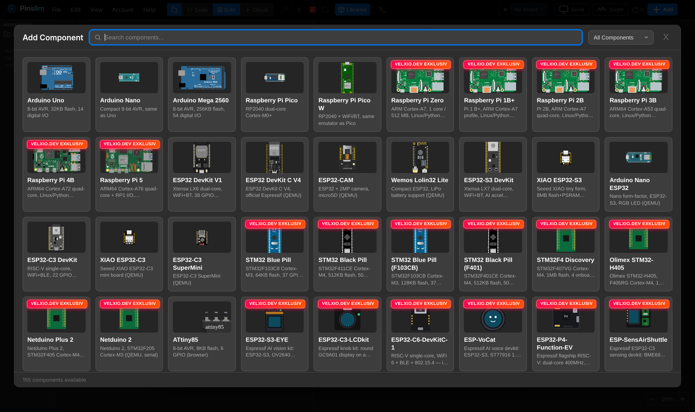

# Pinslim: Browser-Based Embedded Simulator & Hardware Flasher

**Pinslim** is an open-source multi-board emulator, circuit simulator, and browser hardware flasher for ESP32, Arduino, and embedded systems.

Write Arduino C++, MicroPython, or Python code, compile it, simulate real CPU execution with 150+ interactive electronic components, and flash your compiled code directly to connected hardware via Web Serial — all inside your browser.


*Figure 1: Interactive Pinslim Editor workspace featuring Arduino Uno, code editor, and real-time circuit simulation.*


*Figure 2: Component Picker showing available boards and `VELXIO.DEV EXKLUSIV` badges for pro/online-only hardware.*

---

## 🚀 Features

- **Direct Editor Launch**: Opens directly into the interactive workspace.
- **Light & Dark Themes**: Toggle seamlessly between Dark and Light mode via the View menu.
- **Web Serial Hardware Flashing**: Flash compiled sketches directly to connected ESP32 or Arduino microcontrollers via Web Serial without desktop software.
- **Multi-Board Simulation**: Emulates AVR8 (Arduino Uno / Nano / Mega / ATtiny85), RP2040 (Raspberry Pi Pico), and ESP32 (QEMU backend).
- **Embedded Examples Modal**: Instantly search and load ready-to-run example projects from within the editor.
- **BOM & Schematic Export**: Generate accurate Bill of Materials (CSV) and high-fidelity PNG schematic diagrams.
- **Open-Source Docker Deployment**: Hardened standalone Docker setup requiring no proprietary license keys.

---

## 🐳 Quick Start (Docker & Portainer)

### Local Docker Compose

To run Pinslim locally or on your server with Docker:

```bash
docker compose up -d --build
```

Then open **<http://localhost:3082>** in your browser.

### Portainer & Traefik Deployment

When deploying Pinslim as a Stack in **Portainer** directly from the Git repository:

* **Repository Branch**: Use `master` (e.g., `https://github.com/TJRSchmidbauer/pinslim.git#master`).
* **Dockerfile Name**: Specify `Dockerfile.standalone` under `build.dockerfile`.
* **Internal Port**: Set Traefik server loadbalancer port to `80` (internal Nginx port).

A ready-to-use Stack template is available in [`docker/portainer-stack.yml`](docker/portainer-stack.yml).

---

## 🔒 Security & Server Hardening

For details on deploying Pinslim securely on your own server (process isolation, capability dropping, CPU/RAM limits, sub-process sandboxing), see the [SECURITY.md](SECURITY.md) guide.

---

## 📜 Legal, AI Development & Trademark Disclaimers / Rechtliche Hinweise

### 1. Origin Notice & Gratitude
Pinslim is an independent open-source fork based on **Velxio**, created by **David Montero Crespo**.
- Original Repository: [github.com/davidmonterocrespo24/velxio](https://github.com/davidmonterocrespo24/velxio)
- Official Platform: [velxio.dev](https://velxio.dev)

Special thanks to **David Montero Crespo** for architecting the original simulator engine.

### 2. Antigravity AI Notice
Sämtliche Anpassungen, Refactorings, UI/UX-Optimierungen, Stücklisten- & PNG-Export-Erweiterungen, Web-Serial-Flasher-Integration sowie Sicherheitshärtungen an dieser Codebasis wurden in kooperativer Entwicklung unter Einsatz des KI-Assistenten **Antigravity** (Google DeepMind) umgesetzt.

### 3. Trademark Disclaimer
All product names, trademarks, logos, and brands mentioned in this project (such as *Arduino, ESP32, Espressif, Raspberry Pi, MicroPython, SAMD, RP2040, etc.*) are the property of their respective trademark owners. Pinslim is an independent open-source community project and is **not affiliated with, sponsored by, or endorsed by** any of these trademark holders.

### 4. Commercial Licensing & Partner Disclaimer 
- Commercial licenses or Pro subscriptions are sold exclusively by David Montero Crespo via [velxio.dev](https://velxio.dev). Pinslim does not sell commercial licenses or process payments.
- Any partners, sponsors, or commercial hardware suppliers referenced in connection with the original Velxio project belong solely to Velxio and David Montero Crespo. They are **not partners or sponsors of Pinslim**.

### 5. License & Warranty Disclaimer (Lizenz & Haftungsausschluss)
Pinslim is licensed under the **GNU Affero General Public License v3.0 (AGPLv3)**. The software is provided "AS IS", without warranty of any kind, express or implied.

### 6. Quellen & Referenzen / Sources & References
- [Velxio](https://github.com/davidmonterocrespo24/velxio) - Original-Basis-Projekt von David Montero Crespo
- [Wokwi](https://wokwi.com) - Inspirationsquelle & Elektronik-Simulator-Plattform
- [wokwi-elements](https://github.com/wokwi/wokwi-elements) - Open-Source Web-Komponenten für elektronische Bauteile
- [avr8js](https://github.com/wokwi/avr8js) - In-Browser AVR8 Microcontroller Emulations-Engine
- [rp2040js](https://github.com/wokwi/rp2040js) - In-Browser RP2040 Microcontroller Emulations-Engine
- [arduino-cli](https://github.com/arduino/arduino-cli) - Command-Line Interface für Arduino Sketches
- [Monaco Editor](https://microsoft.github.io/monaco-editor/) - Code-Editor Engine (VS Code in-browser)
- [ESP-IDF](https://github.com/espressif/esp-idf) - Espressif IoT Development Framework für ESP32/RISC-V
- [QEMU](https://www.qemu.org/) - Open-Source Machine Emulator (ESP32 & Raspberry Pi System-Simulation)
- [Fritzing](https://fritzing.org) - Open-Source Hardware Initiative & Vektorgrafiken für elektronische Bauteile

